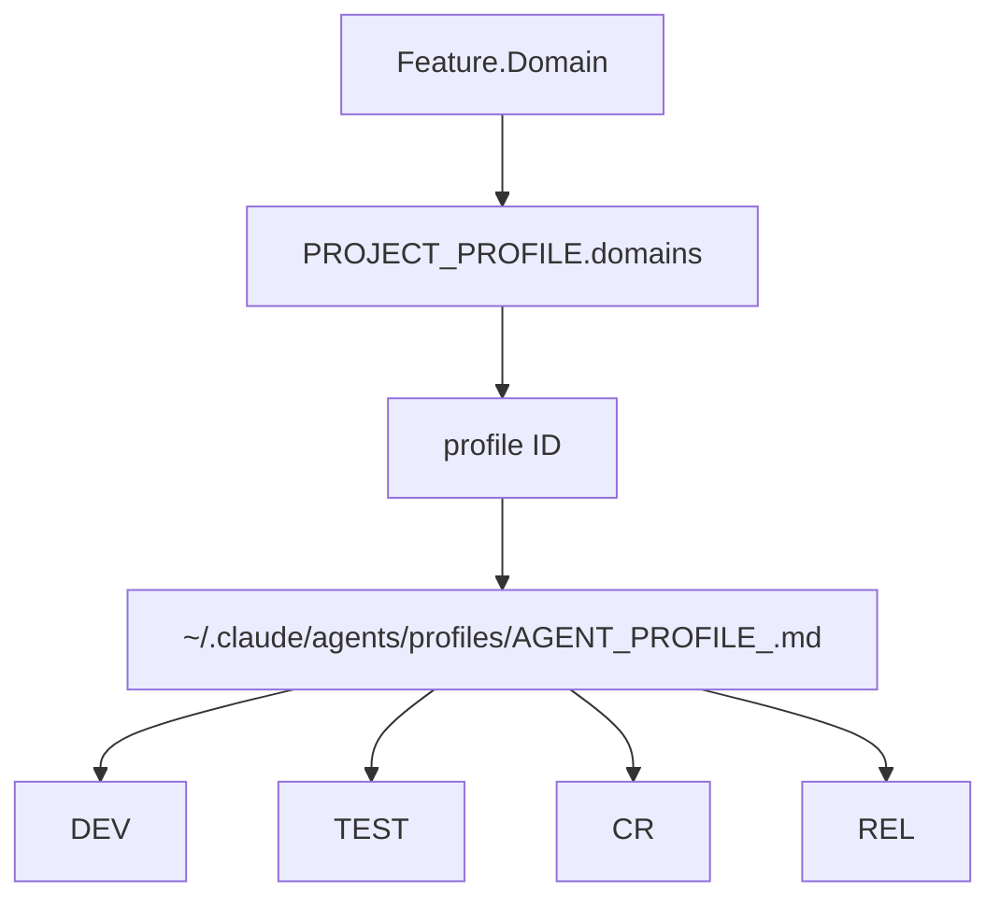
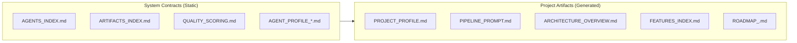

# Multi-Agent Development Pipeline (Claude Code)

## Назначение

Данная система представляет собой **формализованный мультиагентский пайплайн разработки программного обеспечения**,
построенный поверх Claude Code.

Система предназначена для:

- преобразования человеческого намерения в реализованный продукт
- управления сложной разработкой через формальные стадии
- обеспечения высокого и воспроизводимого качества (≥ 9/10)
- поддержки multi-domain и multi-platform проектов
- минимизации ручного контроля без потери управляемости

---

## Ключевые принципы

### 1. Agent-first архитектура

Каждый этап разработки выполняется **отдельным специализированным агентом**  
с чётко зафиксированной ролью и границами ответственности.

### 2. Artifact-driven workflow

Агенты **не общаются напрямую** — они взаимодействуют **исключительно через артефакты**.

### 3. Profile-aware execution

Разработка выполняется в строгом соответствии с **доменно-специфичными профилями**  
(backend, web, mobile, multiplatform, cli и др.).

### 4. Quality gates вместо доверия

Качество обеспечивается:

- формальными критериями
- обязательными проверками
- циклической верификацией
- минимальным порогом acceptance = **9/10**

### 5. Human-in-the-loop там, где это критично

Человек участвует:

- в формулировке задачи
- в утверждении пайплайна
- в финальном принятии результата

---

## Общая схема пайплайна

```text
Human
  ↓
Pipeline Orchestrator
  ↓
[Analysis]
  Research Agent
  System Analyst Agent
  ↓
[Architecture & Decomposition]
  Solution Architect Agent
  Feature Decomposition Agent
  ↓
[Planning]
  TDD Planner Agent
  ↓
[Execution per Feature]
  Developer Agent
  Test Engineer Agent
  Code Reviewer Agent
  Feature Verifier Agent (score ≥ 9)
  ↓
[System Verification]
  System Verifier Agent
  ↓
[Documentation]
  Documentation Agent
  ↓
[Release]
  Release / DevOps Agent
````

---

## Структура системы

### Глобальная структура (рекомендуемая)

```text
~/.claude/agents/
├── AGENTS_INDEX.md
├── ARTIFACTS_INDEX.md
├── QUALITY_SCORING.md
├── pipeline-orchestrator.md
├── project-profile-generator.md
├── pipeline-prompt-generator.md
├── research-agent.md
├── system-analyst.md
├── solution-architect.md
├── feature-decomposer.md
├── tdd-planner.md
├── developer-agent.md
├── test-engineer.md
├── code-reviewer.md
├── feature-verifier.md
├── system-verifier.md
├── documentation-agent.md
├── release-devops.md
└── profiles/
    ├── AGENT_PROFILE_backend.md
    ├── AGENT_PROFILE_web.md
    ├── AGENT_PROFILE_mobile-android.md
    ├── AGENT_PROFILE_mobile-ios.md
    ├── AGENT_PROFILE_multiplatform.md
    └── AGENT_PROFILE_cli.md
```

---

## Типы файлов

### 1. System Contracts (статические)

* `AGENTS_INDEX.md`
* `ARTIFACTS_INDEX.md`
* `QUALITY_SCORING.md`
* спецификации агентов
* `AGENT_PROFILE_*.md`

Эти файлы:

* не генерируются
* не меняются в рамках проекта
* определяют **как работает система**

---

### 2. Pipeline Artifacts (проектные)

Генерируются агентами в рамках конкретного проекта:

* PROJECT_PROFILE.md
* PIPELINE_PROMPT.md
* ANALYSIS.md
* ARCHITECTURE_OVERVIEW.md
* FEATURES_INDEX.md
* ROADMAP_<feature>.md
* и др.

---

## Профили агентов (Agent Profiles)

### Что такое профиль

`AGENT_PROFILE_*.md` — это **исполняемый контракт**, определяющий:

* допустимые технологии
* архитектурные паттерны
* правила тестирования
* нефункциональные приоритеты
* запреты и ограничения

### Где хранятся профили

```text
~/.claude/agents/profiles/
```

### Как выбирается профиль

```text
Feature.Domain
→ PROJECT_PROFILE.domains
→ profile ID
→ AGENT_PROFILE_<profile>.md
```

Если профиль отсутствует → **hard fail**.

---

## Quality Model

* Единая шкала качества: **0–10**
* Минимальный порог acceptance: **9**
* Score < 9 → обязательный возврат в разработку
* Усреднение оценок запрещено
* Один провал = непринятие результата

Подробности см. `QUALITY_SCORING.md`.

---

## Роль человека

Человек:

* формулирует задачу на естественном языке
* утверждает:

    * PROJECT_PROFILE (human-readable)
    * PIPELINE_PROMPT
* может остановить пайплайн на любом этапе

Человек **не**:

* пишет ТЗ вручную
* управляет агентами напрямую
* выставляет quality score

---

## Поддерживаемые сценарии

* Backend-only проекты
* Web-приложения
* Mobile (Android / iOS)
* Multi-platform решения
* CLI-инструменты
* Композитные multi-domain проекты

---

## Гарантии системы

* Воспроизводимость
* Контролируемое качество
* Масштабируемость
* Минимизация импровизации агентов
* Прозрачность каждого этапа

---

## Ограничения

* Система требует дисциплины артефактов
* Плохая входная формулировка → плохой результат
* Не заменяет продуктового мышления человека
* Не подходит для хаотичной или исследовательской разработки без формализации

---

## Статус

* **Статус:** Production-ready (архитектурно)
* **Назначение:** сложные, долгоживущие проекты
* **Уровень:** system / enterprise-grade

---

## Лицензия и использование

Система может использоваться:

* как внутренняя платформа
* как основа для кастомных пайплайнов
* как reference-архитектура для agent-based development

---

## 1. High-Level Pipeline (Mermaid)

```mermaid
flowchart TD
    H[Human Intent] --> O[Pipeline Orchestrator]

    O --> PP[Project Profile Generator]
    PP -->|PROJECT_PROFILE.md| O
    PP -->|PROJECT_PROFILE_HUMAN.md| H

    O --> PG[Pipeline Prompt Generator]
    PG -->|PIPELINE_PROMPT.md| H
    H -->|Approval| O

    %% Analysis
    O --> R[Research Agent]
    R --> A[ANALYSIS.md]

    O --> SA[System Analyst Agent]
    SA --> TR[TECH_REQUIREMENTS.md]
    SA --> SCOPE[SCOPE.md]

    %% Architecture & Decomposition
    O --> ARCH[Solution Architect Agent]
    ARCH --> AO[ARCHITECTURE_OVERVIEW.md]

    O --> FD[Feature Decomposition Agent]
    FD --> WBD[WORK_BREAKDOWN.md]
    FD --> FI[FEATURES_INDEX.md]

    %% Planning
    O --> TDD[TDD Planner Agent]
    TDD --> RM[ROADMAP_<feature>.md]

    %% Execution Loop
    O --> DEV[Developer Agent]
    DEV --> IR[IMPLEMENTATION_REPORT_<feature>.md]

    DEV --> TEST[Test Engineer Agent]
    TEST --> TRP[TEST_REPORT_<feature>.md]

    TEST --> CR[Code Reviewer Agent]
    CR --> CRP[CODE_REVIEW_<feature>.md]

    CR --> FV[Feature Verifier Agent]
    FV --> FVP[FEATURE_VERIFICATION_<feature>.md]

    %% Quality Gate
    FVP -->|Score >= 9| O
    FVP -->|Score < 9| DEV

    %% System Verification
    O --> SV[System Verifier Agent]
    SV --> SVP[SYSTEM_VERIFICATION.md]

    %% Documentation
    SVP --> DOC[Documentation Agent]
    DOC --> README[README.md]
    DOC --> ARCHDOC[ARCHITECTURE.md]
    DOC --> USAGE[USAGE.md]

    %% Release
    DOC --> REL[Release / DevOps Agent]
    REL --> DEP[DEPLOY.md]
    REL --> RN[RELEASE_NOTES.md]
````

---

## 2. Execution Loop (Feature-Level)

```mermaid
flowchart LR
    DEV[Developer] --> TEST[Test Engineer]
    TEST --> CR[Code Reviewer]
    CR --> FV[Feature Verifier]

    FV -->|Score >= 9| ACCEPT[Feature Accepted]
    FV -->|Score < 9| DEV
```

---

## 3. Profile Resolution Flow



---

## 4. System vs Project Artifacts



---

## 5. ASCII Diagram (Terminal-Friendly)

```text
[ Human ]
    |
    v
[ Orchestrator ]
    |
    +--> Project Profile Generator
    |        |
    |        +--> PROJECT_PROFILE_HUMAN.md --> Human (approval)
    |
    +--> Pipeline Prompt Generator
    |        |
    |        +--> PIPELINE_PROMPT.md ------> Human (approval)
    |
    +--> Research Agent ------------------> ANALYSIS.md
    |
    +--> System Analyst ------------------> TECH_REQUIREMENTS.md
    |                                     SCOPE.md
    |
    +--> Solution Architect -------------> ARCHITECTURE_OVERVIEW.md
    |
    +--> Feature Decomposer --------------> WORK_BREAKDOWN.md
    |                                      FEATURES_INDEX.md
    |
    +--> TDD Planner --------------------> ROADMAP_<feature>.md
    |
    +--> Developer ----------------------> IMPLEMENTATION_REPORT
             |
             v
        Test Engineer -------------------> TEST_REPORT
             |
             v
        Code Reviewer -------------------> CODE_REVIEW
             |
             v
        Feature Verifier ----------------> FEATURE_VERIFICATION
             |                |
             | score < 9       | score >= 9
             +---------------->+----> Orchestrator
             |
             +----------------> Developer (fix loop)
    |
    +--> System Verifier ----------------> SYSTEM_VERIFICATION.md
    |
    +--> Documentation Agent ------------> README.md
    |                                     ARCHITECTURE.md
    |                                     USAGE.md
    |
    +--> Release / DevOps --------------> DEPLOY.md
                                          RELEASE_NOTES.md
```

---

## 6. Ключевые архитектурные акценты

* Агенты **не общаются напрямую**
* Все взаимодействие — через артефакты
* Профили — глобальные, статические
* Quality gate = Feature Verifier (score ≥ 9)
* Один проект → много доменов → один пайплайн


